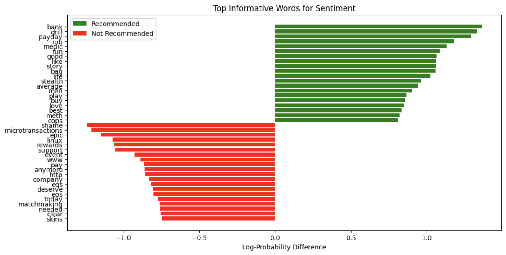
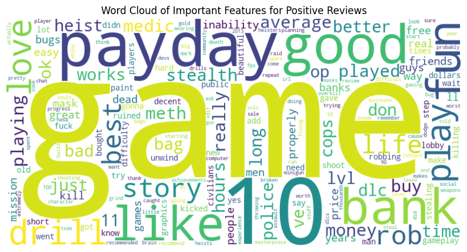
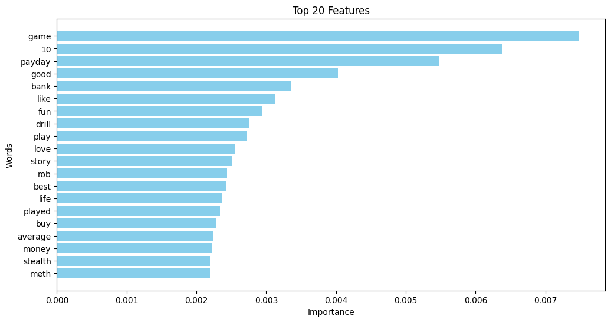
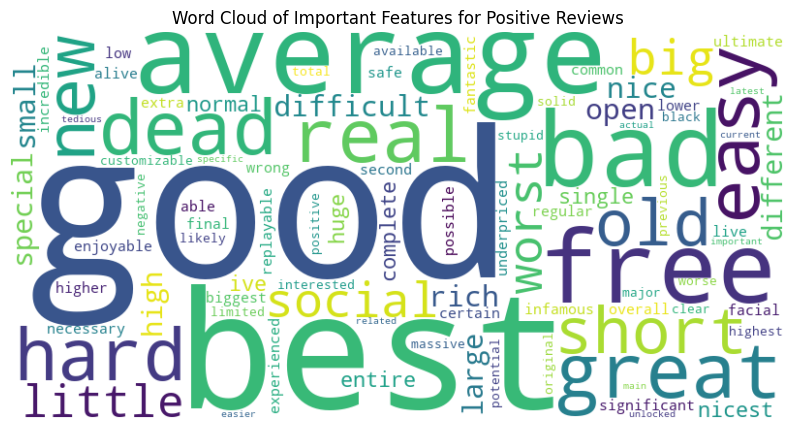
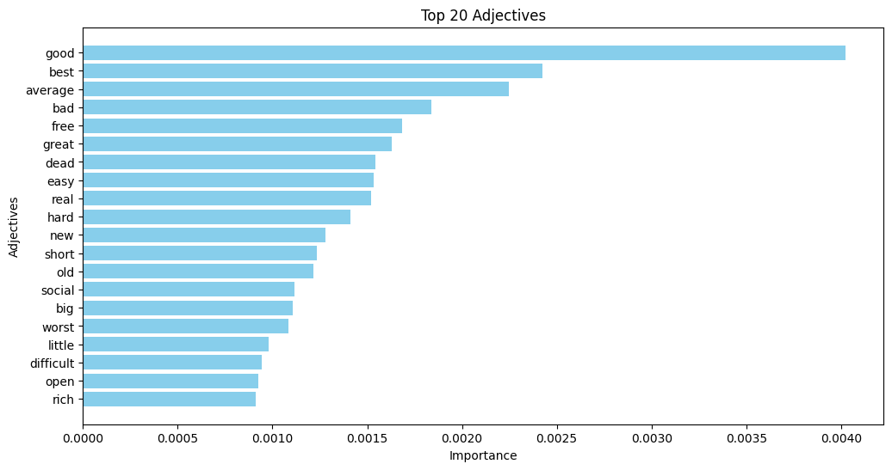
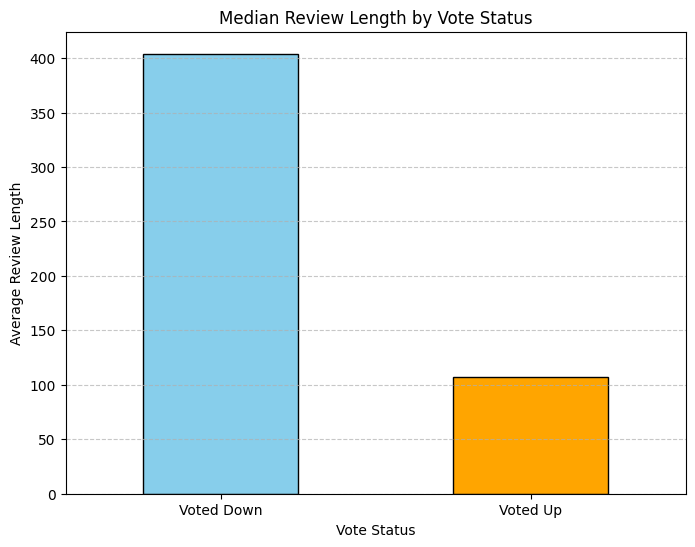
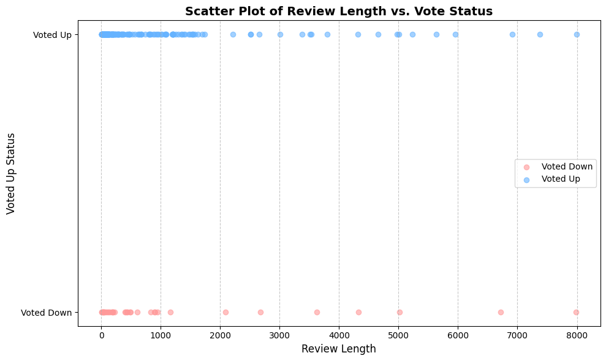
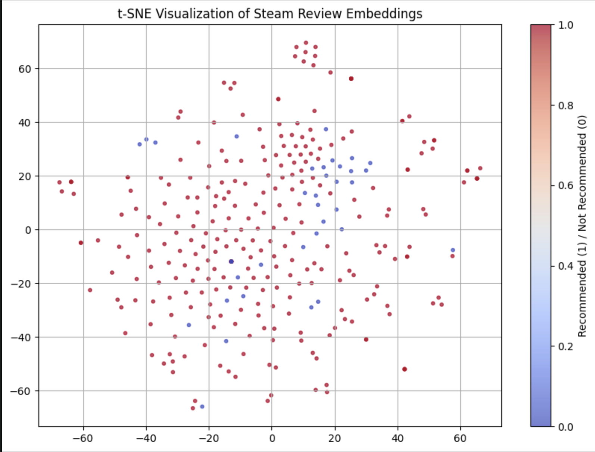
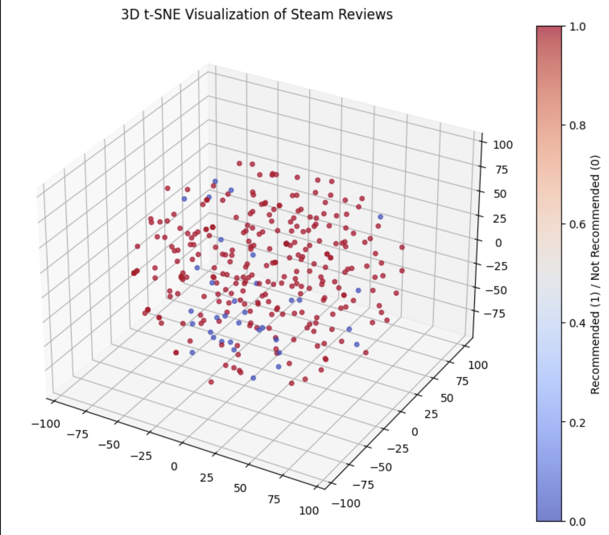

## Steam Review Sentiment Analysis

## Description
Steam is an online marketplace where consumers can purchase digital commodities, primarily video game keys. One distinct characteristic of Steam is its review system, where users can choose to recommend or not recommend a game they have played to other prospective buyers. The goal of this project is to conduct sentiment analysis on steam reviews to see how they might predict game review positivity.

## Goals
This project aims to analyze specific features in the description of a game review (e.g. certain keywords like "good story" or "great graphics") and how they affect the positivity of a review. 

## Data
We used the following dataset from Kaggle: https://www.kaggle.com/datasets/kieranpoc/steam-reviews/data. The dataset contains records for individual reviews, as well as key features for these reviews such as what game they reviewed and a steam generated helpfulness score. We also used the Steam API to measure playercounts over time. We will primarily focus on the content of the user review.

## Feature Vectorization
By making use of models such as Bag of words, TF-IDF, and Latent Semantic Analysis, we can turn the contents of each review into meaningful features for our models. Bag of words and TF-IDF represent two different methods of measuring vocabulary frequency across documents. Via LSA, it becomes possible to computationally reason about the semantics of particular words. LSA creates a low rank approximation of the data that allows similar words to be captured.

## Modeling
We pre-processed the data by first filtering out English reviews only and from a particular game to limit the size od our data. We then represented our data using Bag of Words and TF-IDF to capture word frequencies/importance, respectively. After that, we use Naive Bayes to determine the word probabilities in each class (Voted Up / Voted Down)

## Visualization
We used word clouds, scatter charts and bar charts to visualize the frequencies of certain key phrases that appeared in the data. As for the word clouds, we created a dictionary that mapped words to their importance using TF-IDF. We filtered out function words (i.e "the", "and", "an", etc.) and have two word cloud models: one that visualizes general words and one that focuses only on adjectives. In conjuction with the word cloud models, we also include bar charts to highlight the importance of the top 20 features.

Here is a bar chart displaying the top words most informative to the Naive Bayes classifier, showing the highest contributors to predicting recommended (green) and not recommended (red) reviews. Many of these words reflect PAYDAY 2-specific vocabulary and known platform sentiments.

    

 

Here's the word cloud and bar charts for top "general" words found in reviews of PAYDAY 2. 

    
    

 

Here's the word cloud and bar charts for top adjectives found in those same reviews of PAYDAY 2. 

    
    

 

We used bar charts and a scatterplot to compare the length of the review and whether or not the review was "Voted Up" or "Voted Down" (in other words, whether or not it was a positive review).

    
    

 

We used a 2D and 3D t-SNE visualization of the reviews, which shows that recommended and not recommended reviews do not form distinct clusters, suggesting sentiment is distributed subtly rather than forming separable groups.

    
    

 

## Test Plan
We plan on randomly selecting 20% of the records from the Kaggle dataset for testing and 80% of the records for training.

##Google Colab link:
https://colab.research.google.com/drive/13i5jrVx0f_AFSONIkNkGbxOgZwippBAg?usp=sharing
