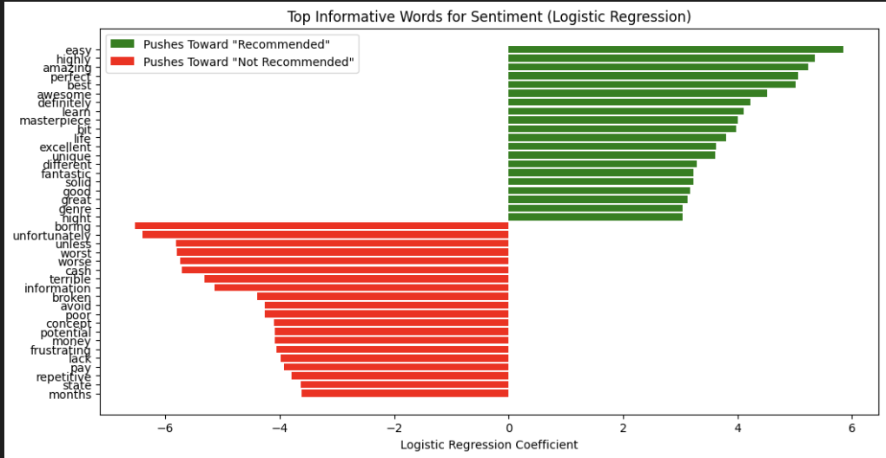
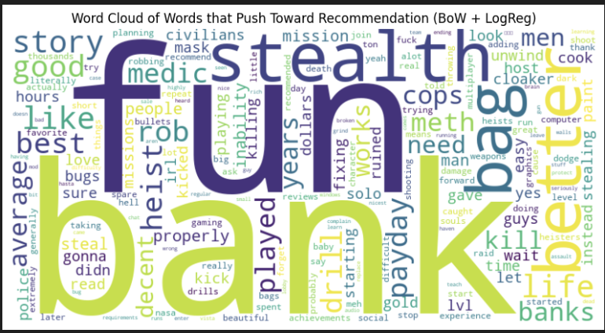
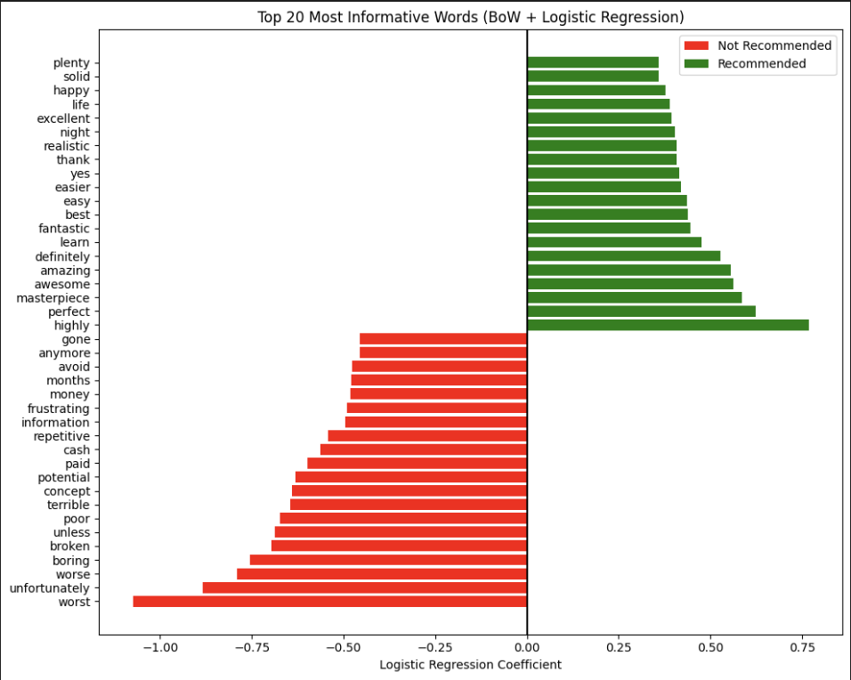

## How to build and run the code
Run "make install" in the terminal. This will run the Makefile, creating a folder for the virtual environment, installing dependencies from requirements.txt, and register the virtual environment as a Jupyter kernel named "Python (venv)". If running on VS code, open the notebook. In the top right, select "Python (venv)". Then, run the notebook as desired. If you are using our pretrained BERT model, simply run the code blocks until you create the documents and labels, then go down to the code block which loads the model.

If the makefile does not work, try the following steps:
1. (optional) Create a virtual environement
Run "python -m venv venv" in the VS code terminal

2. (optional) Activate the environment
Mac: source .venv/bin/activate
Windows Powershell: .venv\Scripts\Activate.ps1

3. Install dependencies
Run "pip install -r requirements.txt"

4. Register environment for notebook use
Run "pip install ipykernel"
Run "python -m ipykernel install --user --name=venv --display-name "Python (.venv)""

## Steam Review Sentiment Analysis
Link to Midterm Youtube Video: https://youtu.be/9W7UCZSQ-lc

## Description
Steam is an online marketplace where consumers can purchase digital commodities, primarily video game keys. One distinct characteristic of Steam is its review system, where users can choose to recommend or not recommend a game they have played to other prospective buyers. The goal of this project is to conduct sentiment analysis on steam reviews to see how they might predict game review positivity.

## Goals
This project aims to analyze specific features in the description of a game review (e.g. certain keywords like "good story" or "great graphics") and how they affect the positivity of a review. 

## Data
We used the following dataset from Kaggle: https://www.kaggle.com/datasets/kieranpoc/steam-reviews/data. The dataset contains records for individual reviews, as well as key features for these reviews such as what game they reviewed and a steam generated helpfulness score. We will primarily focus on the content of the user review.

## Feature Vectorization
By making use of models such as Bag of words, TF-IDF, and Latent Semantic Analysis, we can turn the contents of each review into meaningful features for our models. Bag of words and TF-IDF represent two different methods of measuring vocabulary frequency across documents. Via LSA, it becomes possible to computationally reason about the semantics of particular words. LSA creates a low rank approximation of the data that allows similar words to be captured.

Bag of words and LSA did not work well with our Naive Bayes model (see modeling), and as a result we did not do any further work with them. In theory, Bag of Words might be more sensitive to the length of the document (and therefore the presence of unique vocabulary) and common words such as “the” or “is” might dominate probability calculations in naive Bayesian models. TF-IDF addresses these issues by downweighting common words and normalizing by document length. The reasoning behind LSA’s poor performance is that features become correlated as a result of dimensionality reduction. Theoretically, this violates the assumptions of conditional independence that Naive Bayesian models are built on.

Between the midterm and the final, we tried implementing VADER along with both the bag of words and TF-IDF feature matrices. However, VADER provided no significant increases in performance at a high computational cost. Lastly, our BERT model used a base BERT tokenizer that considered the text uncased.

## Modeling
We pre-processed the data by first filtering out English reviews only to limit the size of our data and chose the game PAYDAY 2 to be our focus. We then represented our data using TF-IDF to capture word frequencies and importance, respectively. After that, we created a Naive Bayes classifier to model our data. We chose Naive Bayes to be the best approach since it assigns probabilities to words and allows us to find the best features or words that people say are good about the game. However, we recognize that since most of the PAYDAY 2 reviews contains mostly positive reviews, the accuracy may not be representative of the data.

By the end of the project, we had expanded to all english reviews regardless of game with a weighted helpfulness score above 0.8. Still, this amounted to hundreds of thousands of records. Some new models we tried included linear regression, logistic regression, and BERT. BERT performed by far the best, with a testing set accuracy and f-1 score of 0.938 and 0.967 respectively.

## Visualization
We used word clouds, scatter plots, and bar charts to explore how different textual features contributed to the prediction of review sentiment for **PAYDAY 2** on Steam. Unlike the earlier Naive Bayes approach, we now use **Logistic Regression**, which allows us to interpret each word's influence using its learned model coefficient.

We filtered out common function words (e.g., “the,” “and,” “an”) and created multiple visualization types:
- A bar chart of top influential words based on positive and negative weights.
- Word clouds highlighting words with strong sentiment leanings.
- Additional views using both **TF-IDF** and **Bag-of-Words (BoW)** representations.
- Adjective-specific breakdowns, since adjectives are typically sentiment-rich.
- Review-length comparisons and dimensionality reduction using t-SNE.

## Top Informative Words for Sentiment  
This bar chart shows the **top 20 most influential words** based on their coefficients in the **Logistic Regression classifier** trained on TF-IDF features. Words pushing reviews toward “Recommended” are shown in green, while those nudging toward “Not Recommended” are in red. These weights provide insight into how specific vocabulary (e.g., “fun,” “stealth,” “bank” vs. “microtransactions,” “shame”) correlate with user sentiment.

    

 

## Word Cloud (BoW + Logistic Regression)  
Using a BoW-based Logistic Regression model, we generated a word cloud highlighting the words that **most strongly pushed reviews toward a recommendation**. Larger words indicate a higher positive influence. Words like “stealth” and  "story" are emphasized — suggesting that positively perceived gameplay elements tend to dominate in recommended reviews.

## Top Informative Words (BoW + LogReg)  
This BoW-based coefficient bar chart complements the word cloud by showing both **positive and negative sentiment drivers**. It confirms that criticisms related to monetization and content delivery (e.g., “microtransactions,” “dlc,” “com,” “shame”) are some of the strongest predictors of negative sentiment.

    
    

 

## Adjective Analysis  
We filtered the TF-IDF feature set for **adjectives only**, then ranked them by absolute model coefficient. This lets us highlight words that describe perceived **quality, experience, and tone**. Common high-impact adjectives included “average,” “best,” “free,” “great,” and “stupid” — words that sharply define player emotion and opinion.

    

 

## Top Features by TF-IDF Weight  
In addition to coefficient-based rankings, we also visualized the top TF-IDF features based purely on their weight (not direction). These included frequent terms like “game,” “10,” “payday,” “drill,” and “play,” which indicate prominence rather than sentiment.

    

 

## Review Length vs. Sentiment  
We analyzed the **median review length** by sentiment label, finding that **negative reviews tend to be significantly longer** than positive ones. This likely reflects that dissatisfied players are more inclined to explain or justify their rating in greater detail.

    

 

A scatterplot further shows this distribution, confirming a trend where short reviews are often positive, while longer reviews skew negative.

    

 

## BERT Visualizations
After creating a BERT model, we analyzed the attention heads of the model, telling us the relationships between words that the model keys in on for given sample sentences. Below is an example of a sample negative review, where the model appears to do well identifying some low level semantic relationships between the words. For example, there exist strong attention heads between the words "hard to recommend" and "not a fan" (although the strength is overshadowed by the attention heads to the line separator that comes later). There are other times when the model isn't quite sure how to handle the language, as in the latter picture. For example, "text art" can be common among steam reviews. When faced with text art, the uniform symbols are quite difficult for the model to identify key relationships, instead opting to generally create attention heads with tokens close in proximity.

    
    

 

Here is a classification matrix of the BERT model on a random sample of 10000 reviews (the classification matrix took extremely long to load) and some performance metrics. Unfortunately, it seems that the model does not handle negative reviews very well. That is, there are many false positives in the confusion matrix and the model appears to guess that the review is positive almost all of the time. There may be some room for optimism, as the testing accuracy on the whole testing set and f1-score were 0.938 and 0.967 respectively.

    

 

## Test Plan
We plan on randomly selecting 20% of the records from the Kaggle dataset for testing and 80% of the records for training.
In the future, we plan on choosing alternative models that account for multiple words, word order and grammatical choices.

##  Google Colab link:
https://colab.research.google.com/drive/13i5jrVx0f_AFSONIkNkGbxOgZwippBAg?usp=sharing

## Link to pretrained model:
https://drive.google.com/file/d/1Uat70L-x_utodAIRKzGQFxvv-u9JlcRD/view?usp=sharing 
